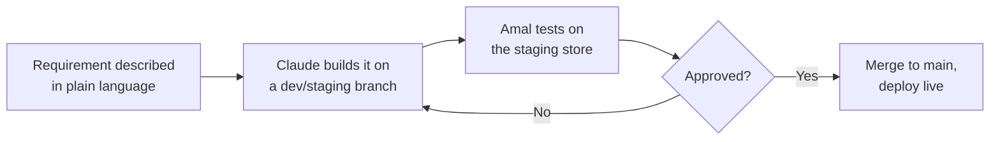
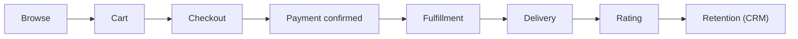

# GCC Perfumes & Cosmetics — Shopify Store


A Shopify build for a perfumes & cosmetics launch across the GCC — Arabic-first, English secondary. This repository is the single source of truth for the build: code, documentation, and the live tracker of what's blocking launch.

## Contents

- [Overview](#overview)
- [Roles & working model](#roles--working-model)
- [How a build task flows](#how-a-build-task-flows)
- [Customer journey](#customer-journey)
- [Tech stack](#tech-stack)
- [Repository structure](#repository-structure)
- [Documentation](#documentation)
- [Current status](#current-status)
- [License](#license)

## Overview

The store targets one or more GCC markets with a native Shopify storefront, a regional payment gateway, WhatsApp + Klaviyo–driven CRM, and third-party fulfillment at launch. The full build plan — phases, timelines, complexity levels, and open decisions — lives in [`docs/roadmap.md`](docs/roadmap.md).

## Roles & working model

| Who | Role | Responsible for | Out of scope |
|---|---|---|---|
| **Amal** | Product owner / moderator | Defines requirements, tests every build on staging, approves before it goes live, runs day-to-day store content | Writing code |
| **Claude** | Developer | Builds/edits the theme, custom apps, and automations; pushes to GitHub; documents everything so it isn't locked to one person | Business or budget decisions |
| **Faisal** | Financial owner | Budget, supplier payments, margins, P&L, ROI tracking, payment settlement reconciliation | Code or moderation |

### AI agents

Five AI-managed roles do ongoing work in their lane — even when nobody's actively driving Claude — and hand drafts to Amal for approval before anything goes live, per the operations model in `docs/roadmap.md`. Full charters: [`docs/agents/`](docs/agents/README.md).

| Agent | Owns | Blocked on (Phase 0) |
|---|---|---|
| Designer | Layout, UX, design system, section specs | Brand kit, RTL theme selection |
| Chatbot / Call Center | WhatsApp + FAQ support flows | WhatsApp Business API + BSP account |
| Dispatcher | Fulfillment, courier selection, delivery exceptions | Launch country, courier account |
| Marketing Agency | Campaigns, Klaviyo flows, social, competitive alerts | Klaviyo, WhatsApp BSP, social/Prisync accounts |
| SEO Content Writer (AR/EN) | Product/blog copy, meta tags, keyword strategy | ~~Master product catalog~~ cleared — first real batch landed |

## How a build task flows



Every change is documented — see [`CONTRIBUTING.md`](CONTRIBUTING.md) for branching, commit, and review conventions.

## Customer journey

Every phase of the build exists to make one of these eight steps work reliably — nothing is built for its own sake.



## Tech stack

| Layer | Choice | Notes |
|---|---|---|
| Storefront | Shopify (Online Store 2.0), RTL-ready theme | Arabic-first, English secondary |
| Catalog | Matrixify + Google Sheets master catalog | Owned by Amal, outside this repo |
| Payments | Regional gateway — MyFatoorah / Tap / PayTabs / Telr | Hosted checkout, keeps card data out of PCI scope |
| CRM / email | Klaviyo | Native Shopify integration |
| Messaging | WhatsApp Business API + Zoko/WATI | Automated templated messages, checkout links in-chat |
| Delivery | Third-party courier (Aramex / iMile / local) at launch | In-house delivery app is a later, separate build |
| Reporting | Shopify analytics + Looker Studio | No custom BI dashboard pre-launch |

Full detail in [`docs/architecture.md`](docs/architecture.md) and [`docs/integrations.md`](docs/integrations.md).

## Repository structure

```
layout/, templates/, sections/,
snippets/, assets/, config/,
locales/, vendor/    Shopify theme (Online Store 2.0) — at repo root,
                     a Shopify GitHub-integration requirement, see THEME.md
apps/                Custom (L3) apps/services — created as needed
docs/                Roadmap, checklists, integration tracker, architecture
docs/agents/         Charters for the 5 AI agent roles (Designer, Chatbot/Call Center,
                     Dispatcher, Marketing, SEO Content Writer)
docs/design/         Designer agent output — briefs, wireframes
docs/support/        Chatbot/Call Center agent output — flows, FAQ, escalation rules
docs/dispatch/       Dispatcher agent output — fulfillment SOP, courier matrix
docs/marketing/      Marketing agent output — content calendar, Klaviyo flow specs
docs/seo/            SEO Content Writer agent output — keyword strategy, content templates
.github/             PR/issue templates, CI workflows
.env.example         Every env var a custom app needs — no real values
```

## Documentation

| Document | Purpose |
|---|---|
| [`docs/roadmap.md`](docs/roadmap.md) | Full phased build plan, timeline, and complexity levels (L1/L2/L3) |
| [`docs/setup-checklist.md`](docs/setup-checklist.md) | Live blocker checklist — accounts, approvals, and decisions needed, by owner |
| [`docs/integrations.md`](docs/integrations.md) | Every third-party integration: purpose, requirements, status |
| [`docs/architecture.md`](docs/architecture.md) | Planned repo structure and tech stack in detail |
| [`docs/agents/`](docs/agents/README.md) | Charters for the 5 AI agent roles and how they operate unattended |
| [`THEME.md`](THEME.md) | The Shopify theme itself — base, status, directory structure |
| [`docs/deployment.md`](docs/deployment.md) | How the theme reaches the actual store (GitHub → Shopify), setup steps, branch mapping |
| [`docs/payment-gateway-comparison.md`](docs/payment-gateway-comparison.md) | MyFatoorah vs. Tap vs. PayTabs vs. Telr across all GCC markets |
| [`docs/catalog-import.md`](docs/catalog-import.md) | How the raw supplier product list becomes a Matrixify-ready import |
| [`content/legal/README.md`](content/legal/README.md) | Terms, Privacy, and Refund/Shipping policy drafts — status and what needs legal review |
| [`CONTRIBUTING.md`](CONTRIBUTING.md) | Branching, workflow, and commit conventions |
| [`CHANGELOG.md`](CHANGELOG.md) | Notable changes to this repository, by date |

## Current status

**Phase 0 — Setup & Foundation.**

- **Launch scope confirmed:** all GCC markets (not a single-country launch)
- **Theme in place:** Shopify's Dawn v16.0.0, vendored in full at the repo root, with RTL wired at the document level (`dir="rtl"`/`dir="ltr"` follows the active storefront language automatically) — see [`THEME.md`](THEME.md). It's unbranded — no logo/colors/fonts yet.
- **Store connected.** `9gucqc-qy.myshopify.com` is linked to this repo via Shopify's native GitHub integration (deployment doesn't go through the Shopify API — Claude's session can't reach it — the store pulls from this repo instead; see [`docs/deployment.md`](docs/deployment.md)). Preview confirmed working.
- **Now the only real blocker:** brand kit (name, logo, color palette) from Amal — theme, RTL wiring, and store connection are all in place and waiting on it.
- **Long lead time, start now regardless:** WhatsApp Business API approval and payment gateway merchant KYC — now evaluated against all-GCC coverage, not one country.

See [`docs/setup-checklist.md`](docs/setup-checklist.md) for the complete, owner-tagged list.

## License

Proprietary — all rights reserved. This repository and its contents are not licensed for reuse, distribution, or public disclosure without explicit permission from the project owner.
